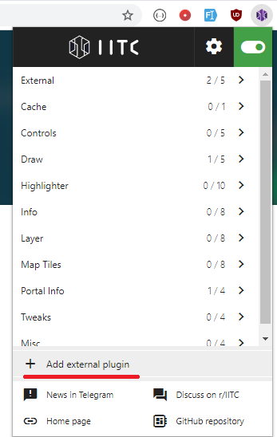
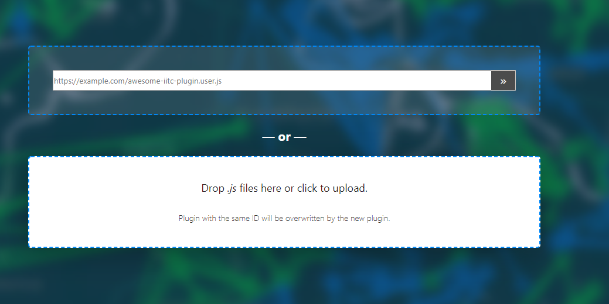
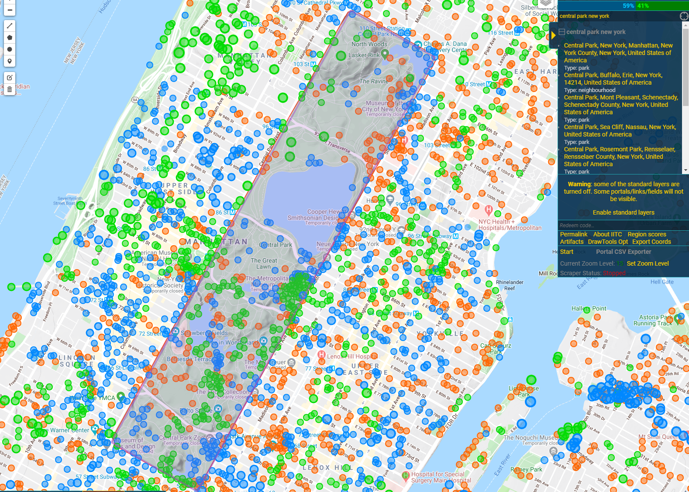
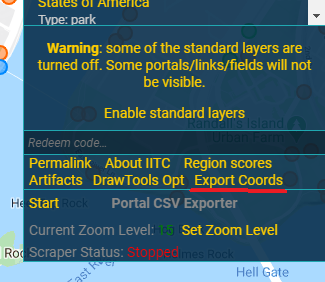

# Ingress Map Coordinates Exporter

This plugin allows you to download ingress map portal coordinates in [Lat,Lon] format from within the viewport or from a drawn polygon. Shout out to [ modkin ](https://github.com/modkin/Ingress-IITC-Multi-Export) for the original work, I just modified it a bit in order to export it in the desired format for this project.

# How To

## IITC Button Extension
Go to [ITTC Buttton Extention](https://iitc.app/download_desktop.html) website and install the right extension for your browser

## Install This Plugin

Once the IITC Extesion is instaled, you need to install this plugin by adding it as an extran plugin to the extension

Then either use a direct link for the plugin, or download the file and upload it manually

## Ingress Map

Go to [Ingress Map](https://intel.ingress.com/intel) and login with your Ingress account (required, or you wont me able to see the map), then load to an area you wich and wait for all portals to load. 
* Depending of your area and zoom level, you may have different results and it may take longer to load, so be patient

Once the portals are loaded, draw a polygon (with the draw tools at the top left cornor) over the are you want to export(in this example, I've drawn a polygon over Central Park)

## Exporting

Once you have the selected area marked, press the **Exort Coords** button

An then select the desired export option:

* **Current View**: exports every portal visible on the window

* **Polygon**: exports every portal inside the first drawn polygon

Now you have a set of coordinates that you can use to create your gpx route

